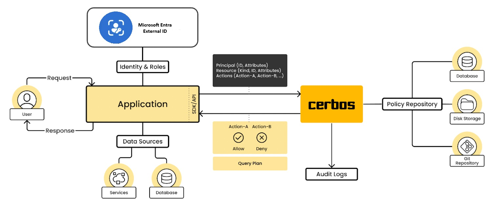
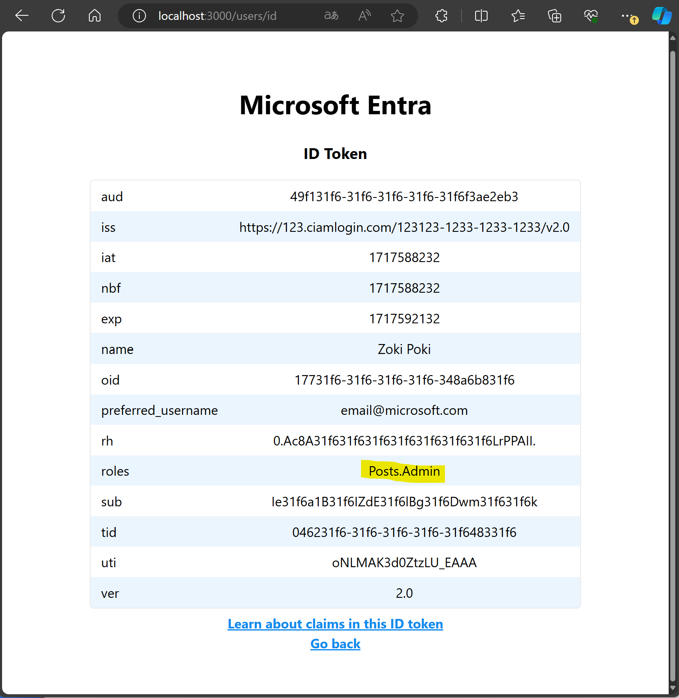

# Node.js & Express Web App with Microsoft Entra External ID and Cerbos

This sample demonstrates a Node.js & Express web app that lets users authenticate with [Microsoft Entra External ID](https://learn.microsoft.com/en-us/entra/external-id/external-identities-overview) and authorize actions with [Cerbos](https://cerbos.dev/).

## Overview


This project includes a web application that allows users to perform CRUD operations on posts. The authorization logic is implemented using Cerbos policies, which define the actions that users can perform on specific resources. The policies can be found in *Cerbos/policies/post.yaml* . Below you can see the table of permitted actions by role.

| Role      | Create  |   Edit  | Delete  |   View              |
| --------- | ------- | ------- | ------- | -------             |
| **User**  |    Y    |  Owner  |  Owner  | Owner All Published |
| **Admin** |    N    |    Y    |    N    |    All              |


To authenticate users and retrieve their identity information, such as name and roles, the web application utilizes Microsoft Entra External ID. The implementation of the web application is based on the [A Node.js & Express web app authenticating users against Microsoft Entra External ID  with MSAL Node](https://github.com/Azure-Samples/ms-identity-ciam-javascript-tutorial/tree/main/1-Authentication/5-sign-in-express) tutorial.


## Prerequisites

Before getting started, make sure you have the following prerequisites:

- [Node.js](https://nodejs.org) installed on your machine.

- A code editor such as [Visual Studio Code](https://code.visualstudio.com/download).

- Docker for running the [Cerbos Policy Decision Point (PDP)](https://docs.cerbos.dev/cerbos/0.6.0/installation/container.html).

- An External ID for customers tenant. If you don't already have one, you can [sign up for a free trial](https://aka.ms/ciam-free-trial?wt.mc_id=ciamcustomertenantfreetrial_linkclick_content_cnl) or [create a tenant with customer configurations in the Microsoft Entra admin center](https://learn.microsoft.com/en-us/entra/external-id/customers/quickstart-tenant-setup).

- (Optional) [PowerShell](https://learn.microsoft.com/en-us/powershell/scripting/install/installing-powershell) - This guide also provides alternative step-by-step instructions to complete the Microsoft Entra configuration.

## Microsoft Entra Configuration

To enable your application to sign in users with Microsoft Entra, you must register your application. Creating [app registration](https://learn.microsoft.com/en-us/entra/identity-platform/quickstart-register-app) establishes a trust relationship between the app and Microsoft Entra. When you register an application, External ID generates a unique identifier known as an Application (client) ID, a value used to identify your app when creating authentication requests.

In this sample we offer two options to create this configuration, by using PowerShell script or following the step by step guid using the Entra portal. 

**Option A - Step-by-step UI guide**

The full guide can be found [here](./EntraStepByStepGuide.md).

**Option B - PowerShell script**

1. Run the script to create your Microsoft Entra ID application and configure the code of the sample application accordingly.

   ```PowerShell
   cd .\AppCreationScripts\
   .\Configure.ps1 -TenantId "your test tenant's id" -AzureEnvironmentName "[Optional] - Azure environment, defaults to 'Global'"
   ```

Find more information about the script [here](./AppCreationScripts/AppCreationScripts.md).

- After running the script don't forget to follow the instructions from the script output. You wll have to [create user flows](https://learn.microsoft.com/en-us/entra/external-id/customers/how-to-user-flow-sign-up-sign-in-customers) to allow users to sign up in the [application](https://learn.microsoft.com/en-us/entra/external-id/customers/how-to-user-flow-add-application).


## Start Cerbos

1. Start up the Cerbos PDP instance docker container. This will be called by the express app to check authorization.

```bash
cd Cerbos
./start.sh
```

## Configure the Express APP

### Install project dependencies

1. Open a console window, and change to the directory that contains the Node.js sample app:

    ```console
        cd App
    ```

1. Run the following commands to install app dependencies:

    ```console
        npm install
    ```
### Configure the sample web app

1. In your code editor, open the *.env* file in the *App* directory.

1. Change the values for the following variables:

    1. `TENANT_SUBDOMAIN` - replace it with the Directory (tenant) subdomain. For example, if your tenant primary domain is `contoso.onmicrosoft.com`, use `contoso`. If you don't have your tenant name, learn how to [read your tenant details](https://learn.microsoft.com/en-us/entra/fundamentals/how-to-find-tenant).

    1. `CLIENT_ID` - replace it with the Application (client) ID of the app you registered earlier.
   
    1. `CLIENT_SECRET` and replace it with the app secret value you copied earlier.
 

### Run and test the sample web app

To test the sample Node.js web app, follow these steps:

1. Start the Node.js server by running the following command in your terminal:

    ```console
    npm start 
    ```

2. Open your browser and navigate to `http://localhost:3000`. You should see a page similar to the screenshot below:
    

3. Once the page has loaded, click on the **Sign in** link. You will be prompted to sign in.

4. On the sign-in page, enter your email address, click **Next**, enter your password, and then click **Sign in**. If you don't have an account, you can click on the **No account? Create one** link to start the sign-up flow.

5. If you choose the sign-up option, you will need to provide your email, one-time passcode, new password, and other account details to complete the sign-up flow. 

6. To sign out of the web app, click on **Sign out**. You can also click on **View ID token claims** to view the ID token claims returned by Microsoft Entra.

## Assign Admin role

If you wan't to switch your role and get admin permissions, follow this steps:

1. Sign in to the [Microsoft Entra admin center](https://entra.microsoft.com) as at least a [Cloud Application Administrator](~/identity/role-based-access-control/permissions-reference.md#cloud-application-administrator). 
1. Browse to **Identity** > **Applications** > **Enterprise applications**.
1. Select **All applications** to view a list of all your applications, and select the application that you created (such as *ciam-client-app*). If your application doesn't appear in the list, use the filters at the top of the **All applications** list to restrict the list, or scroll down the list to locate your application.
1. Select the application in which you want to assign users or security group to roles.
1. Under **Manage**, select **Users and groups**.
1. Select **Add user** to open the **Add Assignment** pane.
1. Select the **Users and groups** selector from the **Add Assignment** pane. A list of users and security groups is displayed. You can search for a certain user or group and select multiple users and groups that appear in the list.
1. Once you've selected users and groups, select the **Select** button to proceed.
1. Select **Select a role** in the **Add assignment** pane. All the roles that you've defined for the application are displayed. Choose **Admin**. 
1. Choose a role and select the **Select** button.
1. Select the **Assign** button to finish the assignment of users and groups to the app.

Confirm that the users and groups you added appear in the **Users and groups** list.

After following the steps in the IT token you should see the Admin role assigned.


